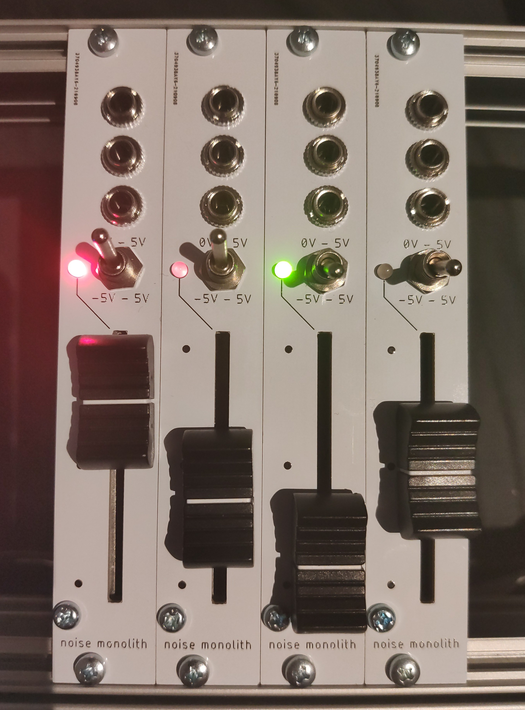

# Eurorack macro fader module
designed by noise monolith\
[noisemonolith.com](https://noisemonolith.com)\
2021

## Functions
The module features a 45mm fader to set a fixed CV and send it to 3 different inputs CV inputs at once. This offers fast and easy macro controls especially during performances. An example would be to map wave shape, filter cutoff and volume of a synth voice to the fader.

### Fader:
Sets the CV out depending on the mode switch.

### Mode switch:
Changes between uni- and bipolar modes. CV range is 0V - 5V in unipolar mode and -5V - 5V in bipolar mode.

### CV LED:
The LED indicates the current CV. Red = 5V, Off = 0V, Green = -5V.

### CV Outputs:
3 buffered identical outputs providing the CV set by the fader.

## Tools
schematics and pcb created with eagle cad

## Schematics

## License
This project is licensed under the [GNU Lesser General Public License Version 3](https://www.gnu.org/licenses/lgpl-3.0.html)
